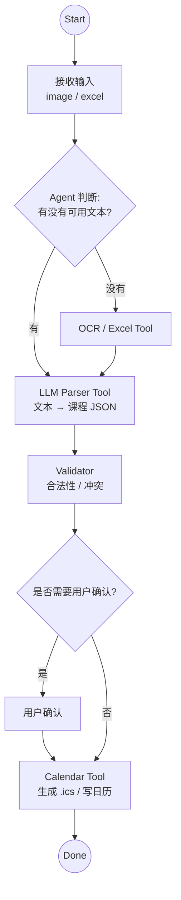

```mermaid
graph TD
    Start((Start)) --> Input[接收输入<br>image / excel]
    Input --> AgentCheck{Agent 判断:<br>有没有可用文本?}
    AgentCheck -- 没有 --> OCR[OCR / Excel Tool]
    AgentCheck -- 有 --> Parser
    OCR --> Parser[LLM Parser Tool<br>文本 → 课程 JSON]
    Parser --> Validator[Validator<br>合法性 / 冲突]
    Validator --> Confirm{是否需要用户确认?}
    Confirm -- 是 --> UserConfirm[用户确认]
    UserConfirm --> Calendar
    Confirm -- 否 --> Calendar[Calendar Tool<br>生成 .ics / 写日历]
    Calendar --> Done((Done))
```

## 本地启动

1. `npm install`
2. `npm run start` at localhost://3000
3. `curl -X POST http://localhost:3000/run`
